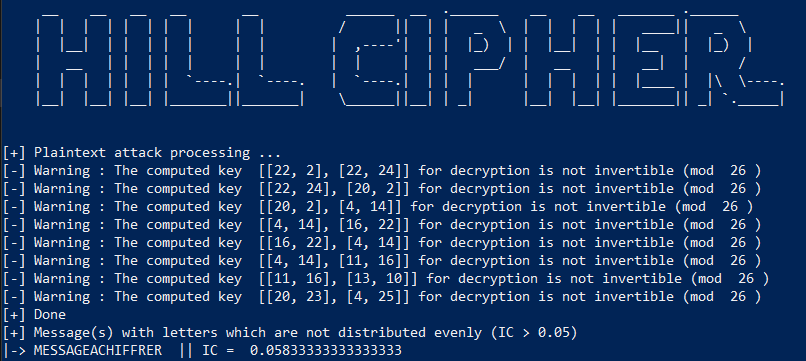

# Hill Cipher

This tool is an implementation of the [Hill Cipher](https://en.wikipedia.org/wiki/Hill_cipher).
In addition, this tool automates the **plaintext attack** Hill cipher with the known key length and a **crib**.


## Usage

```bash
python3 Hill-Cipher.py -t "message" -m "method" -d "dictionary" -k "encryption/decryption key" -p "key_length" -c "crib"
```

## Example

### Encryption method

```bash
python3 Hill-Cipher.py \
	-t "MESSAGEACHIFFRER" \
	-m 'enc'
	-d "{
    'A': 0, 'B': 1, 'C': 2, 'D': 3, 'E': 4, 'F': 5, 'G': 6, 'H': 7, 'I': 8, 'J': 9,
    'K': 10, 'L': 11, 'M': 12, 'N': 13, 'O': 14, 'P': 15, 'Q': 16, 'R': 17, 'S': 18, 'T': 19, 'U': 20, 'V': 21,
    'W': 22, 'X': 23, 'Y': 24, 'Z': 25 }"
    -k "[[3,5], [6,17]]"
```


### Decryption method

```bash
python3 Hill-Cipher.py \
	-t "EKOYEYMYPBXDWHTB" \
	-m 'dec'
	-d "{
    'A': 0, 'B': 1, 'C': 2, 'D': 3, 'E': 4, 'F': 5, 'G': 6, 'H': 7, 'I': 8, 'J': 9,
    'K': 10, 'L': 11, 'M': 12, 'N': 13, 'O': 14, 'P': 15, 'Q': 16, 'R': 17, 'S': 18, 'T': 19, 'U': 20, 'V': 21,
    'W': 22, 'X': 23, 'Y': 24, 'Z': 25 }"
    -k "[[3,5], [6,17]]"
```


### Plaintext attack method

```bash
python3 Hill-Cipher.py \
	-t "EKOYEYMYPBXDWHTB" \
	-m 'attack'
	-d "{
    'A': 0, 'B': 1, 'C': 2, 'D': 3, 'E': 4, 'F': 5, 'G': 6, 'H': 7, 'I': 8, 'J': 9,
    'K': 10, 'L': 11, 'M': 12, 'N': 13, 'O': 14, 'P': 15, 'Q': 16, 'R': 17, 'S': 18, 'T': 19, 'U': 20, 'V': 21,
    'W': 22, 'X': 23, 'Y': 24, 'Z': 25 }"
    -p 2 
    -c "IFFR"
```



## Requirements

The needed libraries to install :
1. numpy
2. sympy

```bash
pip install -r requirements.txt
```